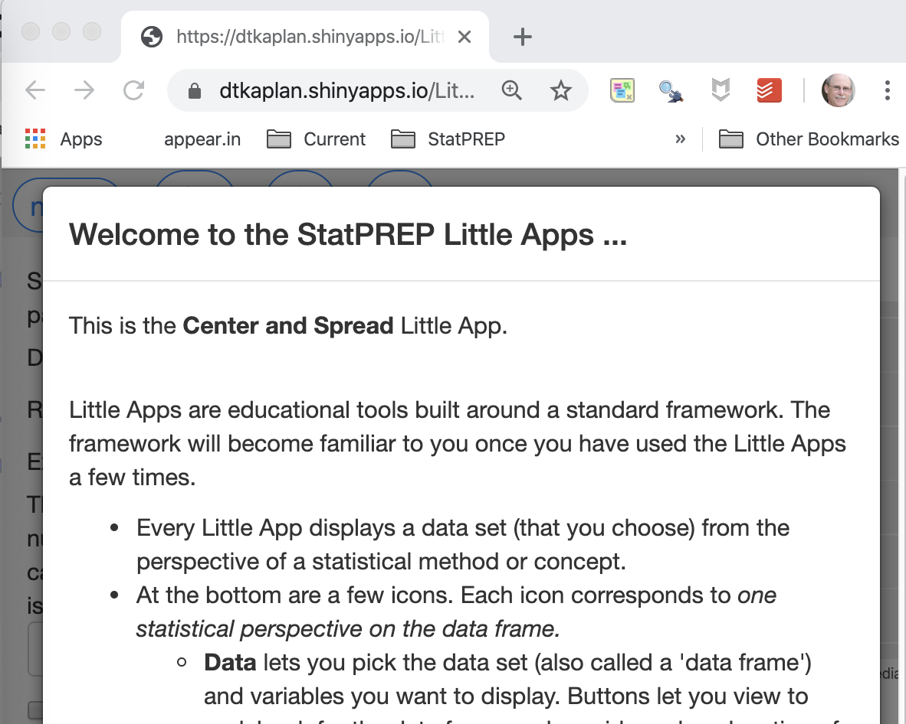
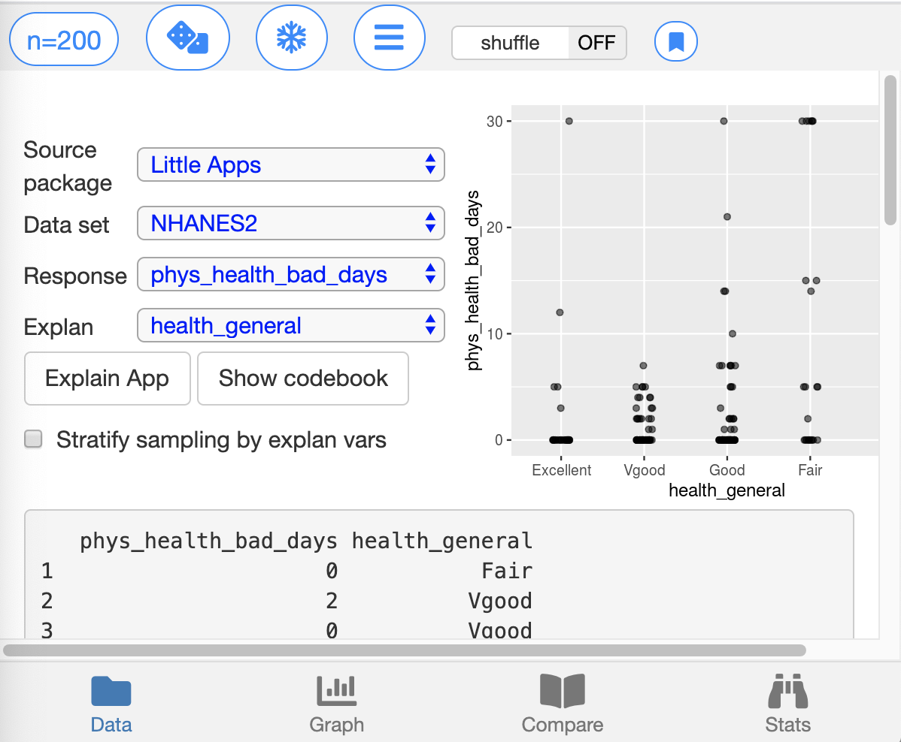
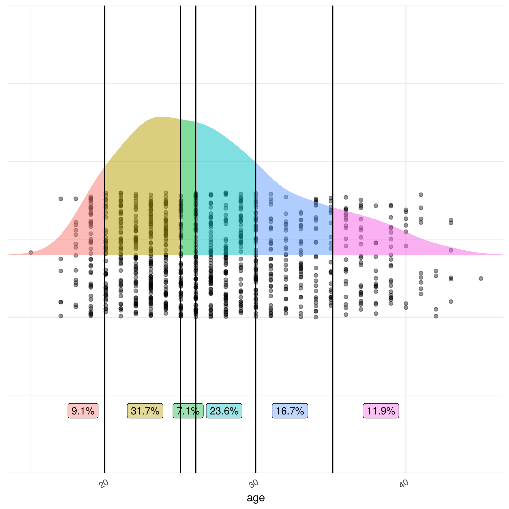
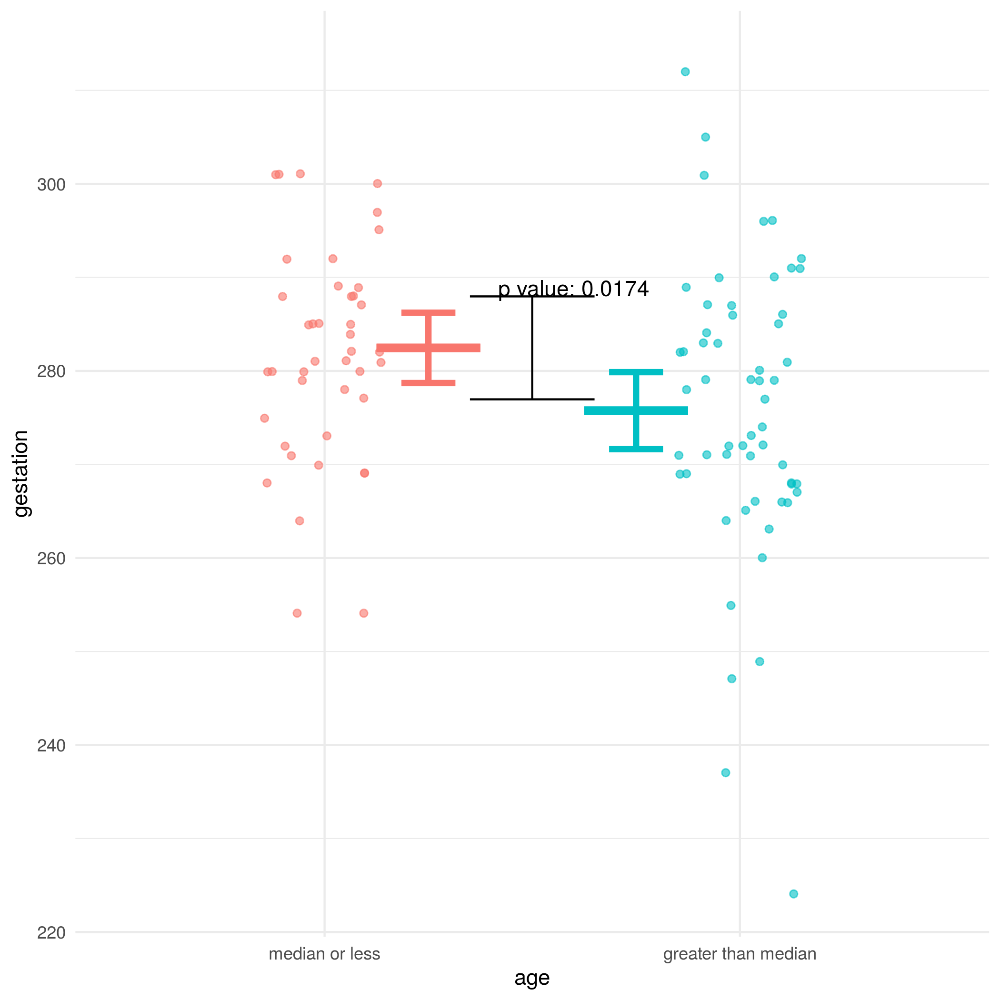
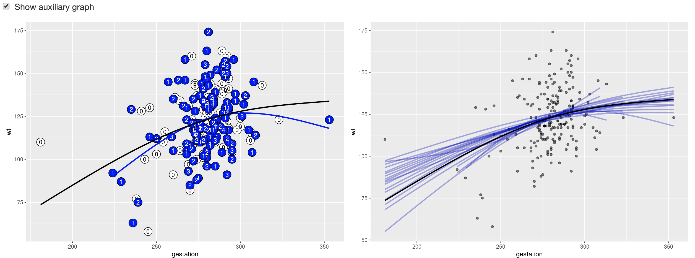
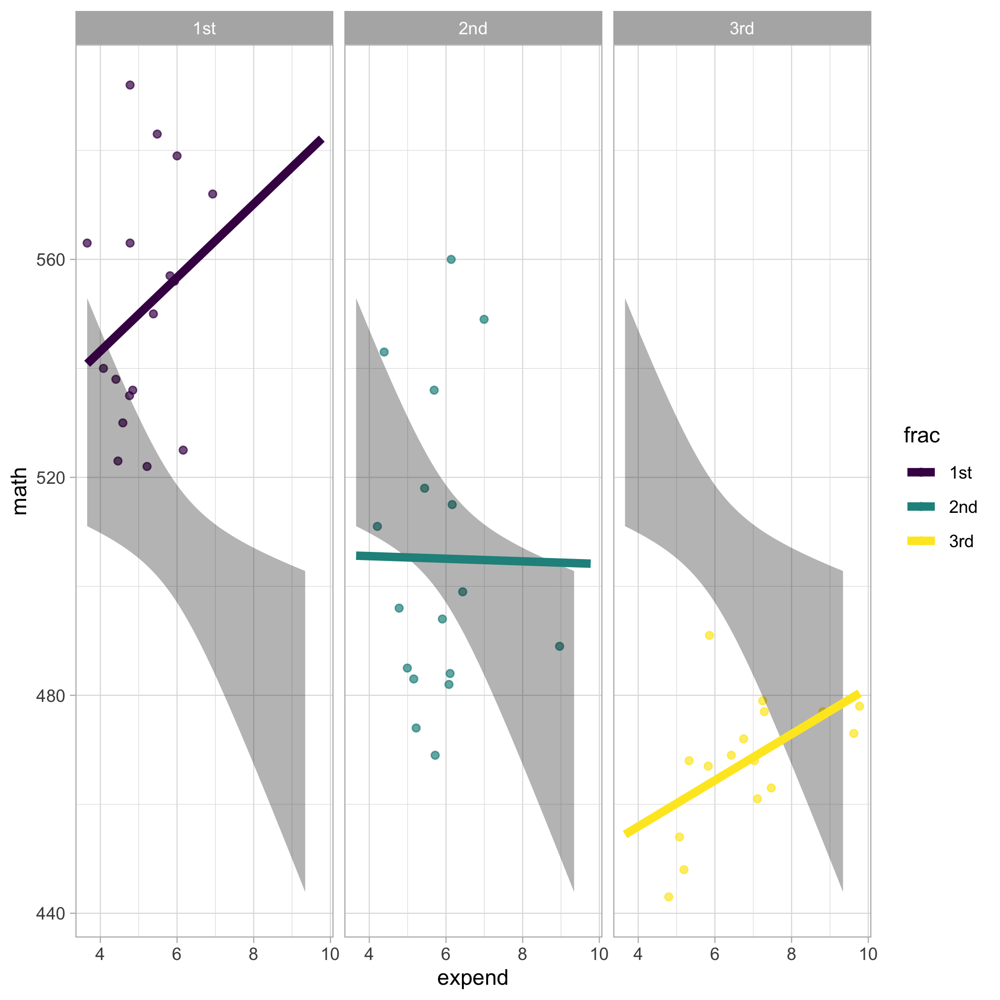
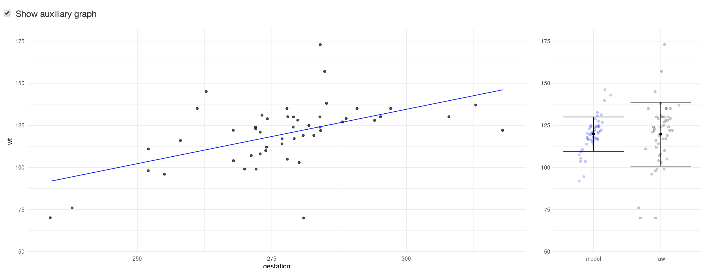

```{r, include = FALSE}
knitr::opts_chunk$set(
  collapse = TRUE,
  comment = "#>")

library(LittleApp2)
library(shiny)
app_url <- function(name) {
  paste0(
    "https://dtkaplan.shinyapps.io/Little_App_", 
    name)
}
```

```{r setup}

```

Little Apps are tools for teaching and learning statistical concepts. They are interactive web pages that display data and statistical graphics in standard web browsers. The Little Apps use modern approaches to graphics and statistical reasoning--more about that later. 

Every Little App involves selecting a data set and producing a random sample of selected variables from that data set. The sample will be graphed and summarized in various ways. The Little Apps make it easy to draw a new sample, allowing the user to quickly get an impression of the extent of sampling variability.

First, we'll focus on the mechanics of using Little Apps, which  are remarkably consistent from one app  to another. 

## Mechanics of Little Apps

Best to follow this introduction to the components of the Little Apps while working with an actual App. Any of the following will do.

1. [Center and Spread](`r app_url("Spread")`)
2. [Points and Densities](`r app_url("Density")`)
3. [Stratification and Confounding](`r app_url("Stratify")`)
4. [Resampling](`r app_url("Bootstrap")`)
5. [Confidence and T](`r app_url("T")`)
6. [Modeling and F](`r app_url("F")`)

### Splash page

Each app starts by displaying a *splash page* with the name of the app and an explanation of the controls that are used by all apps. 

```{r echo=FALSE, fig.cap="Little App splash page", out.width="50%"}

```

You can easily dismiss the splash page by clicking outside the highlighted window or scrolling down to the "Dismiss" button. The experienced  App user will dismiss the splash page immediately.

At the top of the Little App window is the list of display tabs. These include 
- The **Data** selection display 
- A full-screen **Graph** of the current sample.
- Side-by-side graphics to **Compare**  the current display to one  previously frozen.
- A display of numerical **Stats** from the sample and the previously  frozen display.

```{r echo=FALSE, out.width  = "40%",  fig.cap="The four display tabs for all Little Apps"}

```

### Data selection

After dismissing the splash page, you will be brought to the *data selection* tab. As the name suggests, this is where you will choose a data set for display as well as response and explanatory variables.

```{r echo=FALSE, fig.cap="Data selection tab", out.width="50%"}

```

Note that the Little Apps consistently use the paradigm of *response* and *explanatory* variables. Some Little Apps also involve one or two *covariates*. In those few applications where only one variable is being considered, it will be labeled as the *response* variable. 

Several packages of data sets are available, including those provided by some widely used textbooks. (If there is a textbook you would like added to the list, let us know!) You can also upload your own CSV file to use in the App. When the data package  includes documentation, that documentation can be brought up by pressing the "Show codebook" button. 

The data selection tab has two displays of data:  a thumbnail of the main graphic for the app and a simple table showing the first rows of the selected dataset.

At the top of every tab is a small set of controls that are in every app. These controls were explained in the splash page. (You can bring the splash page up again by pressing the `r icon("info")` button.) They let you ...

```{r echo=FALSE, out.width  = "40%",  fig.cap="Top controls shown in  all tabs"}

```

- Set the sample size.
- `r shiny::icon("dice")` Select a new sample.
- `r shiny::icon("snowflake")` Save ("freeze") the current display for comparison to new displays.
- `r shiny::icon("menu")`  Bring up a menu of App-specific controls.
- Shuffle the order of cases in the response variable as in  a "permutation test." Note that while shuffling is checked, *all* new samples will will be shuffled.

###  Graphic Tab

Every Little App is oriented around a custom display of data. The *Graphic* tab displays this main graphic at a large size. (The Data Selection tab shows a thumbnail of the main graphic.) Several of the Little Apps have a second graphical display called the *auxiliary graphic*. When  there is an auxiliary graphic, there will be a checkbox  allowing you to toggle on  and off the display of the auxiliary graphic.

### Compare Tab

The Compare Tab displays the graphics both for the current sample/controls and for a previously frozen (`r shiny::icon("snowflake")`)  sample and the  control settings that  were in  place at that time.

A typical use for `r shiny::icon("snowflake")` is to set a baseline for comparison, for instance:

- a reference display which  you want to compare to newly generated samples to see the magnitude of sampling variation.
- a set sample size which you want to compare to larger or smaller sample sizes.
- a reference display which  you want to compare to data generated according to a Null Hypothesis. Select the *shuffle* feature when you want the data randomized to  implement the Null.

### Stats Tab

Much like the Compare Tab, but shows numerical summaries of the current and frozen data.

One use for this is  to compare a p-value or F or  t  statistic under the Null Hypothesis to what it would be without shuffling. Another use is to explore the consequence of sample size. (The F and t statistics are more-or-less independent of sample size when the data have been generated according to the Null Hypothesis, but the statistics will increase with  sample size if there is a genuine relationship between the response and explanatory variables.)

## Statistical methodologies: quantitative and categorical variables.

Each Little App is centered on a particular statistical methodology, technique, or graphic. For instance, the Center-and-Spread app displays annotations of statistics on a quantitative response variable stratified by  a categorical explanatory variable. Similarly, the t-test app uses an explanatory variable that must have two, and exactly two, levels.

When a variable is not of the correct form, the Little Apps will apply a transformation suited to the the requirements of the particular statistical methodology.  This happens behind the scenes, althoug often a message is displayed advising the user that this has happened.  In every case, however,  the display of raw data in the Data Tab shows the *original form* of the variable.

Some of the common transformations:

1. A categorical variable is to be used in a role requiring a numerical variable. In this case, a reference level for the categorical variable will be picked automatically (typically as the most populated categorical level). Then a 0/1 variable will be constructed, taking on the value  1 for the reference level and 0 for any other level.
2. A numerical variable is to be used in a role requiring a categorical variable. (The t-test,  center-and-spread, and stratification apps each demand a categorical explanatory variable.) The numerical variable is split into two levels: one is the median or below, the other is above the median. 3. A multi-level categorical variable is to  be used in a role (such  as the t-test) where only  two levels can be handled. One of the levels will  be  made a reference level, and all the other levels will be lumped together.

The spirit of the transformations is to make it possible to use any combination of types of variables in each of the Little Apps. Sometimes, however, a data set makes it impossible to do something sensible. For instance, some of the published data sets have little or no variation in some variables. In this situation, no graphic will be generated.

## Response and explanatory variables

By and large, the Little Apps involve examining a relationship between a response variable and one (or more) explanatory variables. Many instructors are used to a pedagogy where statistics of a single, isolated variable are studied first. Only the *Points and Density* Little App is configured to work with just a single variable. (The *t-test* Little App can be put into a one-sample mode by selecting none of the variables to be in the explanatory role.)

The Little Apps are intended to encourage instructors to embrace the response *versus* explanatory paradigm early in their courses.

## The Center-and-spread Little App

The [center-and-spread Little App](`r app_url("Spread")`) corresponds most closely to traditional statistical pedagogy. The App displays annotations of simple statistics of the response variable, stratified by an explanatory variable. For instance, the figure shows the graphics display of baby weight (in ounces) stratified by whether the length of gestation was greater or less than the median. 

```{r echo=FALSE, out.width="50%", fig.cap="Statistical annotations in the Center-and-Spread App"}
knitr::include_graphics("images/center-spread-example.png")
```
 

The annotations shown here are:

1. The mean and standard deviation, with the standard deviation formatted into a ruler. 
2. The 95% "summary interval," that is, the interval that spans the central 95% of the values of the response variable.
3. The 95% confidence interval on the mean.

## Points and Density Little App

The [points-and-density](`r app_url("Density")`) App simply displays the values of a single variable along with a smoothed estimate of the density of that variable. The vertical bars can be dragged to specify regions over which to integrate up the density. You see here, for instance, that 11.9% of births are to mothers aged 35 or older.

```{r echo=FALSE, out.width = "50%", fig.cap="Mother's age at baby's birth"}

```


## T-test Little App

The [T-test App]((`r app_url("T")`)) shows  a quantitative variable versus a two-level categorical variable. Among the annotations that can be placed on the data are the group-wise means and confidence intervals on those means. The length  of the central black bar in the graphic below shows the length of the confidence interval on the difference between the means of the two groups. Unconventionally, but we hope effectively, the bar is always  centered on one of the group means. So when the other group mean falls outside the black interval, a statistically significant difference in population means has been detected.


```{r echo=FALSE, out.width = "50%", fig.cap="Is length of gestation different for older versus younger mothers?"}

```

Some possible activities with the t-test Little App:

- Explore the sampling variability in the p-value by repeatedly drawing a new sample with the `r shiny::icon("dice")` button.
- Observe how randomization leads to p-values  more-or-less uniformly distributed between zero and one.
- Note that the location of the means does not vary much with sample size in  contrast with the length of the confidence interval. Larger samples tend to lead to disproportionately smaller p-values, but only  if there is  a genuine relationship between the response and explanatory  variables.

## Resampling Little App

The purpose of the [resampling App]((`r app_url("Bootstrap")`)) is to demonstrate how resampling can simulate sampling variation. There are two  graphics.  One shows a given sample with annotations showing how many times each row appears in a resampling trial. (Pressing "Resample" makes it clear pretty easily how the sample remains fixed but the resample  varies randomly.) Model forms for both the sample itself and the individual resampling trial are displayed.

```{r echo = FALSE, out.width = "60%", fig.cap = "Resampling graphics: (left) the sample and a single resampling trial; (right) a cohort of resampling trials."}

```

The other graphic shows a cohort of resampling trials (one of which corresponds to the trial in the first graphic).

## Stratification and Confounding Little App

Confounding is an important statistical phenomenon. The [stratification-and-confounding App](`r app_url("Stratify")`) shows how a covariate can alter the preceived relationship between a response and an explanatory variable. The graphic shows the response and explanatory variable along with a model constructed by ignoring the covariate. The separate facets of the graph stratify according to the covariate and show the relationship between the response and explanatory variable for each stratum of the covariate.

```{r echo=FALSE, out.width = "50%", fig.cap = "Educational outcome versus per-pupil spending."}

```
The graphic shows a famous example. Educational outcomes (measured, e.g. by SAT mathematics score) tend to decrease as a function of expenditures. An important factor,  however,  is the  fraction of students who take the standardized test. In states with a large fraction, scores are lower but increase with expenditure. In states with  a high fraction, scores are high (because only  the best students take the test) and also increase with expenditure.

## The Models and F App

A simple, unifying approach to introductory statistics constructs model functions to relate response and explanatory variables. The full gamut of statistical inferential tests can be presented in terms of the F ratio, which itself is easily calculated (by hand) from R^2^. An explanation of the concepts involved is given in the *[Compact Guide to Classical Inference](https://dtkaplan.github.io/CompactInference/)*.

The [models-and-F](`r app_url("F")`) Little App constructs a model between any response variable and explanatory variables, then provides a graphic to show the amount of spread in the model values and in the response values themselves.


```{r echo=FALSE, out.width="60%",fig.cap="Statistical inference on groupwise means, proportions, regression, etc. all boil down to  comparing the spread of model values with the spread of the response variable."}

```


