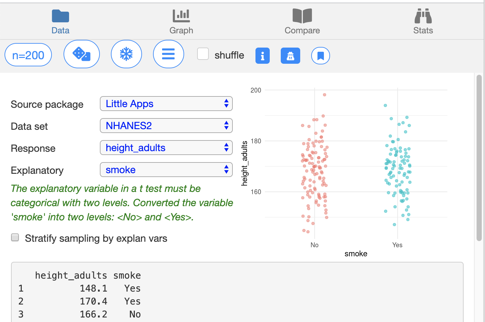
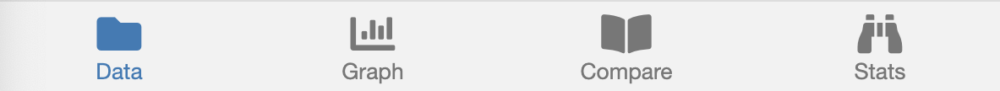

```{r, include = FALSE}
knitr::opts_chunk$set(
  collapse = TRUE,
  comment = "#>")

library(LittleApp2)
app_url <- function(name) {
  paste0(
    "https://dtkaplan.shinyapps.io/Little_App_", 
    name)
}
```

```{r setup}

```

Little Apps are tools for teaching and learning statistical concepts. They are interactive web pages that display data and statistical graphics in standard web browsers. The Little Apps use modern approaches to graphics and statistical reasoning--more about that later. 

Every Little App involves selecting a data set and producing a random sample of selected variables from that data set. The sample will be graphed and summarized in various ways. The Little Apps make it easy to draw a new sample, allowing the user to quickly get an impression of the extent of sampling variability.

First, we'll focus on the mechanics of using Little Apps, which  are remarkably consistent from one app  to another. 

## Mechanics of Little Apps

Best to follow this introduction to the components of the Little Apps while working with an actual App. Any of the following will do.

1. [Center and Spread](`r app_url("Spread")`)
2. [Points and Densities](`r app_url("Density")`)
3. [Stratification and Confounding](`r app_url("Stratify")`)
4. [Resampling](`r app_url("Bootstrap")`)
5. [Confidence and T](`r app_url("T")`)
6. [Modeling and F](`r app_url("F")`)

### Splash page

Each app starts by displaying a *splash page* with the name of the app and an explanation of the controls that are used by all apps. 

```{r echo=FALSE, fig.cap="Little App splash page", out.width="50%"}
knitr::include_graphics("images/splash-page.png")
```

You can easily dismiss the splash page by clicking outside the highlighted window or scrolling down to the "Dismiss" button. The experienced  App user will dismiss the splash page immediately.

### Data selection

After dismissing the splash page, you will be brought to the *data selection* tab. As the name suggests, this is where you will choose a data set for display as well as response and explanatory variables.

```{r echo=FALSE, fig.cap="Data selection tab", out.width="50%"}

```

Note that the Little Apps consistently use the paradigm of *response* and *explanatory* variables. Some Little Apps also involve one or two *covariates*. In those few applications where only one variable is being considered, it will be labeled as the *response* variable. 

Several packages of data sets are available, including those provided by some widely used textbooks. (If there is a textbook you would like added to the list, let us know!) You can also upload your own CSV file to use in the App. When the data package  includes documentation, that documentation can be brought up by pressing the "Show codebook" button. 

The data selection tab has two displays of data:  a thumbnail of the main graphic for the app and a simple table showing the first rows of the selected dataset.

At the top of every tab is a small set of controls that are in every app. These controls were explained in the splash page. (You can bring the splash page up again by pressing the "Explain App" button.) They let you ...

```{r echo=FALSE, out.width  = "40%",  fig.cap="Top controls shown in  all tabs"}
knitr::include_graphics("images/top-controls.png")
```

- Set the sample size.
- Select a new sample.
- Save ("freeze") the current display for comparison to new displays.
- Bring up a menu of App-specific controls.
- Shuffle the order of cases in  the response variable as in  a "permutation test."

At the bottom of every tab is the list of displays. These include 
- The **Data** selection display 
- A full-screen **Graph** of the current sample.
- Side-by-side graphics to **Compare**  the current display to one  previously frozen.
- A display of numerical **Stats** from the sample and the previously  frozen display.

```{r echo=FALSE, out.width  = "40%",  fig.cap="The four display tabs for all Little Apps"}

```
